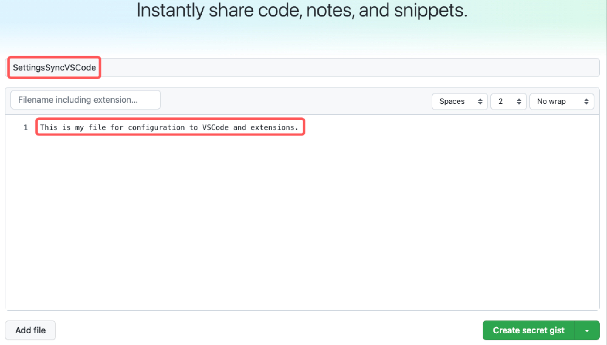

# Settings Sync
## This is an extension for import/export the configuration of VSCode.
### Pre-requisites
- GitHub Account
    - Create gists

> 
> 

### Install and Config extension 'Settings Sync'
1. Install extension **Settings Sync** on Visual Studio Code
2. Login your account on extension **Settings Sync** and select your **Gists** created previously.
3. Click on **Close Tab**

### Reset config extension Settings Sync
1. Press F1
2. Type **Sync: Reset Extension Settings** and click.
3. Press F1
4. Type **Sync: Advanced Options** -> **Sincronizacion: Abrir la Configuracion** and click.

### Upload file config from VSCode Local to Gists
1. Press F1
2. Type **Sync: Update/upload Settings** and click.
3. It will show us a message click on **Yes**
4. It will show us an output on console saying. **Done**
5. Check Gists en GitHub, **cloudSettings**

### Download file config from Gists to VSCode Local
1. Install extension **Settings Sync** on Visual Studio Code
2. Login your account on extension **Settings Sync** and select your **Gists**.
3. Click on **Close Tab**
4. Press F1
5. Sync: Download Settings.
6. It will show us an output on console saying. **Installing extension..**